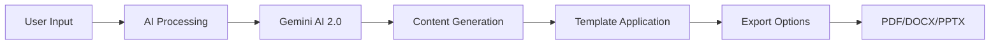

# 🪄 docverse - AI Document Creation Platform

<div align="center">

[](https://nextjs.org/)
[](https://reactjs.org/)
[](https://www.typescriptlang.org/)
[](https://tailwindcss.com/)

[](https://supabase.com/)
[](https://ai.google.dev/)
[](https://stripe.com/)
[](https://www.framer.com/motion/)

[](https://opensource.org/licenses/MIT)
[](https://github.com/Xenonesis/Docverse)
[](https://docverse-psi.vercel.app)
[](https://github.com/Xenonesis/Docverse/releases)
[](http://makeapullrequest.com)
[](./CONTRIBUTING.md)

<br />


### 🚀 **Transform Ideas into Professional Documents with AI Magic**

**docverse** is a **100% open source**, cutting-edge AI-powered document creation platform that revolutionizes how professionals create stunning documents. Built by the community, for the community - simply describe what you need, and watch as our advanced AI transforms your ideas into polished resumes, captivating presentations, comprehensive CVs, and professional letters in seconds.

<br />

### 🎯 **50,000+ Documents Created** • 🏆 **99% Success Rate** • ⭐ **4.9/5 User Rating** • 🌍 **50+ Countries**

> _"Create professional documents in seconds with AI magic ✨"_

<br />

[](https://docverse-psi.vercel.app)
[](https://docverse-psi.vercel.app/about)
[](https://github.com/Xenonesis/Docverse/fork)
[](./CONTRIBUTING.md)
[](./API.md)

</div>

---

## ✨ Core Features & Capabilities

### 🤖 **AI-Powered Document Generation**

- **🎯 Smart Resume Builder**: Create professional resumes with Gemini AI 2.0 Flash and 9-step guided workflow
  
- **📊 Presentation Generator**: Generate complete slide decks with outlines, themes, and shareable public URLs
  
- **📄 CV Creator**: Build comprehensive curriculum vitae with intelligent formatting
  
- **✉️ Letter Composer**: Draft professional letters for any purpose
  
- **🔍 ATS Resume Analyzer**: Advanced ATS compatibility scoring with detailed optimization feedback
<p float="left">
  
  
</p>

- **🎨 Professional Templates**: ATS-optimized templates with modern glass morphism design
  
- **📈 Progress Tracking**: Visual progress indicators and step-by-step completion tracking
  
- **🔗 Presentation Sharing**: Share presentations via public URLs with privacy controls and anonymous viewing

### 🎨 **Modern UI/UX Design**

- **✨ Glass Morphism Interface**: Modern glass-effect components with subtle transparency and blur effects
- **🌈 Gradient Magic**: Dynamic bolt gradients and shimmer effects throughout the interface
- **🎭 Floating Animations**: Smooth floating orbs and animated background elements powered by Framer Motion
- **📱 Responsive Excellence**: Mobile-first design optimized for all screen sizes
- **🌙 Dark/Light Theme**: Seamless theme switching with next-themes
- **♿ Accessibility First**: WCAG 2.1 AA compliant components
- **🎯 Magical Professionalism**: Design philosophy combining cutting-edge visual effects with professional usability
- **Micro-Interactions**: Hover effects, scale transitions, and pulse animations for enhanced user engagement

### 🤖 **AI-Powered Document Generation**

- **Smart Text Processing**: Advanced Gemini AI integration for intelligent content generation
- **Context-Aware Creation**: AI understands industry standards and target audience requirements
- **Multiple Document Types**:
  - 📄 **Professional Resumes** with ATS optimization
  - 🎯 **Stunning Presentations** with smart layouts, charts, and shareable public URLs
  - 🔗 **Shareable Presentations** with privacy controls and anonymous viewing support
  - 📋 **Comprehensive CVs** for academic and research positions
  - ✉️ **Business Letters** with perfect tone and formatting

### 🛠️ **Professional Tools & Features**

- **Progressive Web App (PWA)**: Install docverse as a native app on any device with offline support and enhanced performance
- **Advanced ATS Analyzer**: Comprehensive resume scanning with detailed scoring and optimization suggestions
- **Professional Template Library**: Curated collection of ATS-optimized, modern templates with glass morphism design
- **Guided Resume Builder**: 9-step workflow with progress tracking and intelligent navigation
- **Smart Editing**: Intuitive WYSIWYG editor with real-time preview and mobile-first design
- **Enhanced Export Options**: Download as PDF, DOCX, or PPTX with improved formatting and ATS compatibility
- **Presentation Sharing**: Generate shareable public URLs with one-click sharing and privacy controls
- **Anonymous Viewing**: Public presentations viewable without authentication for seamless sharing
- **Chart Integration**: Automatic data visualization for presentations using Recharts
- **Mobile-Responsive Navigation**: Touch-optimized interface that works perfectly on all devices
- **📄 Comprehensive About Page**: Detailed information about features, technology, security, and roadmap accessible at `/about`
- **🧭 Intuitive Navigation**: Clean header with easy access to Resume, Presentation, Letter tools, and About page
- **Image Integration**: Professional stock photos from Pexels API

## 🛠️ Tech Stack & Architecture

### 🎨 **Frontend Excellence**

- **Next.js 15** - Latest React framework with App Router and Server Components
- **TypeScript 5.2** - Full type safety and enhanced developer experience
- **Tailwind CSS 3.3** - Utility-first styling with custom animations and gradients
- **Radix UI** - Accessible, unstyled component primitives for maximum customization
- **Framer Motion 12** - Smooth animations and micro-interactions
- **Lucide React** - 1000+ beautiful, customizable SVG icons
- **React Hook Form** - Performant forms with validation
- **Zustand** - Lightweight state management

### 🔧 **Advanced Component System**

- **🎨 Radix UI Foundation**: 25+ accessible components including dialogs, dropdowns, and forms
- **📝 Form Management**: React Hook Form with Zod validation for type-safe forms
- **📊 Data Visualization**: Recharts integration for analytics and progress tracking
- **🎪 Interactive Elements**: Carousels, accordions, and collapsible content
- **🎯 Smart Inputs**: OTP inputs, date pickers, and file upload with drag-and-drop
- **🔔 Toast Notifications**: Sonner-powered notifications for user feedback

### 🔐 **Authentication & Security**

- **🛡️ Supabase Auth**: Secure user authentication with JWT tokens
- **🔗 Web3 Wallet Auth**: Sign in with Ethereum (MetaMask) or Solana (Phantom) wallets
- **👤 User Management**: Registration, login, password reset, and profile management
- **🔒 Protected Routes**: Client-side route protection and redirects
- **📊 Session Management**: Persistent sessions with automatic token refresh
- **🔐 Environment Security**: Secure API key management and environment variables

### 💳 **Payment & Subscription System**

- **💰 Stripe Integration**: Secure payment processing with Stripe
- **📋 Subscription Management**: Pro/Free tier management with usage limits
- **🏪 Customer Portal**: Self-service billing and subscription management
- **📊 Usage Tracking**: Monitor document generation limits and analytics
- **🔔 Webhook Handling**: Real-time payment and subscription status updates
- **Glass Morphism Design**: Custom CSS with backdrop-blur and transparency effects
- **Responsive Grid System**: Mobile-first approach with breakpoint optimization
- **Custom Animations**: Floating orbs, shimmer effects, and gradient transitions
- **Accessibility First**: ARIA compliance and keyboard navigation support
- **Theme System**: Dark/light mode with system preference detection

### 🗄️ **Backend & Database**

- **Supabase** - PostgreSQL with real-time subscriptions and Row Level Security
- **Supabase Auth** - OAuth providers, magic links, and secure session management
- **Database Migrations** - Version-controlled schema changes
- **Real-time Updates** - Live collaboration features

### 🤖 **AI & External Services**

- **Google Gemini AI** - Advanced language model for intelligent content generation
- **Pexels API** - Professional stock photography integration
- **Document Parsers** - PDF, DOCX parsing with Mammoth.js and pdf-parse
- **Export Libraries** - jsPDF, docx, and pptxgenjs for multi-format downloads

### 💳 **Payments & Subscriptions**

- **Stripe Integration** - Secure payment processing with webhooks
- **Subscription Management** - Tiered pricing with usage tracking
- **Customer Portal** - Self-service billing and subscription management

### 🚀 **Deployment & Performance**

- **Netlify** - Edge deployment with automatic builds and previews
- **Vercel Ready** - Alternative deployment configuration included
- **Performance Optimized** - Image optimization, code splitting, and caching strategies

## 🎨 UI/UX Design Philosophy

### ✨ **Modern Glass Morphism Interface**

docverse features a cutting-edge design system built around glass morphism principles, creating a sophisticated and intuitive user experience:

- **Glass Effects**: Subtle transparency and backdrop-blur effects throughout the interface
- **Dynamic Gradients**: Custom "bolt gradients" that create visual depth and energy
- **Floating Elements**: Animated orbs and particles that respond to user interactions
- **Shimmer Animations**: Subtle shine effects that guide user attention
- **Responsive Typography**: Fluid text scaling that adapts to all screen sizes

### 🎯 **User Experience Highlights**

#### 📱 **Mobile-First Responsive Design**

- Optimized touch targets for mobile devices
- Swipe gestures and touch-friendly interactions
- Progressive enhancement for larger screens
- Consistent experience across all devices

#### 🌓 **Intelligent Theme System**

- Automatic dark/light mode detection based on system preferences
- Smooth theme transitions with preserved user state
- High contrast ratios for accessibility compliance
- Custom color schemes for different document types

#### ⚡ **Performance-Optimized Interactions**

- 60fps animations using hardware acceleration
- Lazy loading for optimal page speed
- Debounced search and form inputs
- Optimistic UI updates for instant feedback

## 📸 Platform Screenshots

<div align="center">

### 🏠 **Landing Page with Glass Morphism Design**


<p><em>Hero section with floating animations and gradient effects</em></p>

### 📄 **AI Resume Generator Interface**


<p><em>Intelligent resume builder with real-time ATS optimization</em></p>

### 🎯 **Presentation Studio with Smart Layouts**


<p><em>Professional slide creator with automatic chart generation</em></p>

## 🏗️ **Technical Architecture**

### 🚀 **Frontend Stack**

```typescript
// Core Framework
Next.js 15.4.0          // React framework with App Router
React 18.3.1            // UI library with concurrent features
TypeScript 5.8.3        // Type-safe development

// Styling & UI
Tailwind CSS 3.4.17     // Utility-first CSS framework
Radix UI                // Accessible component primitives
Framer Motion 12.23.6   // Animation library
next-themes 0.4.6       // Theme management

// Forms & Validation
React Hook Form 7.60.0  // Performant forms
Zod 3.25.76            // Schema validation
```

### 🔧 **Backend & Services**

```typescript
// Database & Auth
Supabase                // PostgreSQL database + Auth
@supabase/auth-helpers-nextjs 0.10.0
@supabase/supabase-js 2.52.0

// AI & Generation
Google Gemini AI        // Document generation
@google/generative-ai 0.3.1 // Official Gemini SDK

// Payments
Stripe 14.25.0          // Payment processing
@stripe/stripe-js 3.5.0 // Client-side Stripe

// Document Processing
mammoth 1.9.1           // DOCX parsing
pdf-parse 1.1.1         // PDF parsing
docx 8.5.0              // DOCX generation
jspdf 2.5.2             // PDF generation
pptxgenjs 3.12.0        // PowerPoint generation
```

### 📊 **Document Processing Pipeline**



### 🔍 **ATS Analyzer System**


<p><em>Real-time resume analysis with actionable insights</em></p>

</div>

## 📁 Project Structure

```
docverse/
├── app/                      # Next.js app directory
│   ├── api/                  # API routes
│   │   ├── analyze/          # Resume analysis endpoints
│   │   ├── auth/             # Authentication endpoints
│   │   ├── generate/         # Document generation endpoints
│   │   ├── send-email/       # Email sending functionality
│   │   ├── stripe/           # Stripe payment integration
│   │   └── user/             # User data endpoints
│   ├── auth/                 # Authentication pages
│   ├── cv/                   # CV generator page
│   ├── letter/               # Letter generator page
│   ├── presentation/         # Presentation generator page
│   ├── resume/               # Resume generator pages
│   ├── settings/             # User settings page
│   ├── globals.css           # Global styles
│   ├── layout.tsx            # Root layout component
│   └── page.tsx              # Home page
├── components/               # React components
│   ├── auth-provider.tsx     # Authentication context provider
│   ├── document-card.tsx     # Document type card component
│   ├── features-section.tsx  # Features showcase section
│   ├── hero-section.tsx      # Landing page hero section
│   ├── letter/               # Letter-specific components
│   ├── presentation/         # Presentation-specific components
│   ├── resume/               # Resume-specific components
│   ├── site-header.tsx       # Navigation header
│   ├── sponsor-banner.tsx    # Sponsor information banner
│   ├── subscription-button.tsx # Subscription management
│   ├── testimonials-section.tsx # User testimonials
│   ├── theme-provider.tsx    # Dark/light theme provider
│   ├── theme-toggle.tsx      # Theme toggle button
│   └── ui/                   # UI components (shadcn/ui)
├── hooks/                    # Custom React hooks
│   ├── use-subscription.ts   # Subscription state management
│   └── use-toast.ts          # Toast notifications
├── lib/                      # Utility libraries
│   ├── gemini.ts             # Google Gemini AI integration
│   ├── parsers/              # Document parsing utilities
│   ├── stripe.ts             # Stripe payment configuration
│   ├── supabase/             # Supabase client configuration
│   └── utils.ts              # General utility functions
├── public/                   # Static assets
├── supabase/                 # Supabase configuration
│   └── migrations/           # Database migration files
├── types/                    # TypeScript type definitions
│   └── supabase.ts           # Supabase database types
├── .env.local                # Environment variables (not in repo)
├── .eslintrc.json            # ESLint configuration
├── .gitignore                # Git ignore file
├── CONTRIBUTING.md           # Contribution guidelines
├── LICENSE                   # MIT license
├── README.md                 # Project documentation
├── middleware.ts             # Next.js middleware
├── netlify.toml              # Netlify deployment configuration
├── next.config.js            # Next.js configuration
├── package.json              # Project dependencies
├── postcss.config.js         # PostCSS configuration
├── tailwind.config.ts        # Tailwind CSS configuration
└── tsconfig.json             # TypeScript configuration
```

## 🚀 **Quick Start Guide**

### 🌐 **Learn More**

Visit our comprehensive **About Page** at [https://docmagic1.netlify.app/about](https://docmagic1.netlify.app/about) to explore:

- 🎯 **Mission & Vision** - Our commitment to democratizing document creation
- ⚡ **Core Features** - AI-powered tools and capabilities
- 🛠️ **Technology Stack** - Modern tech powering docverse
- 🎨 **Design Philosophy** - "Magical Professionalism" approach
- 🔒 **Security & Quality** - Enterprise-grade security measures
- 🗺️ **Product Roadmap** - Exciting features coming in 2025-2026
- 👥 **Community** - Join our open source community

## 🪟 docverse: Windows Local Development Setup

Make sure to install these before setting up the project:

### Step 1: Install the prerequisite

- [Git](https://git-scm.com/download/win) – for cloning the repository
- [Node.js (LTS version)](https://nodejs.org/en/download/) – includes npm for package management
- (Optional) [Docker Desktop](https://www.docker.com/products/docker-desktop) – for local database/testing (if needed)
- (Recommended) [Visual Studio Code](https://code.visualstudio.com/) – code editor

### Step 2: Clone the Repository

After installing the prerequisites, open your Command Prompt, PowerShell, or Windows Terminal and run the following commands to clone the docverse repository and navigate into the project folder:

    git clone https://github.com/Muneerali199/docverse.git
    cd docverse

This will download the project's source code to your local machine and prepare you to install dependencies in the next step.

### Step 3: Install Project Dependencies

Once you have cloned the repository and navigated into the project folder, install the necessary packages by running one of the following commands in your terminal:

Using npm:

    npm install

This command will download and install all the required dependencies for the docverse project.

### Step 4: Configure Environment Variables

After installing the project dependencies, you need to set up your environment variables for local development.

1.  Copy the example environment file to a new file named `.env.local` using this command in Command Prompt:

        copy .env.example .env.local

    _(If you're using PowerShell or WSL, you can use `cp .env.example .env.local` instead.)_

2.  Open the `.env.local` file in your code editor and add the required API keys, database URLs, or other credentials as needed for your setup.

Make sure to save `.env.local`—this file allows your app to connect to external services and databases during development.

### Step 5: Run the Development Server

Now that your environment variables are configured, you can launch the project locally.

Using npm:

    npm run dev

🎉 **That's it !** Open [http://localhost:3000](http://localhost:3000) to see docverse in action.

---

### 🔧 **Environment Configuration**

Create a `.env.local` file in the root directory:

```bash
# Supabase Configuration
NEXT_PUBLIC_SUPABASE_URL=your_supabase_url
NEXT_PUBLIC_SUPABASE_ANON_KEY=your_supabase_anon_key
SUPABASE_SERVICE_ROLE_KEY=your_service_role_key

# Google Gemini AI
GEMINI_API_KEY=your_gemini_api_key

# Stripe Configuration
STRIPE_SECRET_KEY=your_stripe_secret_key
NEXT_PUBLIC_STRIPE_PUBLISHABLE_KEY=your_stripe_publishable_key
STRIPE_WEBHOOK_SECRET=your_webhook_secret

# Application URL
NEXT_PUBLIC_APP_URL=http://localhost:3000
```

### 🗄️ **Database Setup**

1. **Create Supabase Project**:

   ```bash
   # Visit https://supabase.com/dashboard
   # Create new project
   # Copy your project URL and anon key
   ```

2. **Run Migrations**:

   ```sql
   -- The migrations are in /supabase/migrations/
   -- They will be automatically applied when you set up Supabase
   ```

3. **Set up Authentication**:
   ```bash
   # Enable Email/Password auth in Supabase dashboard
   # Configure email templates (optional)
   # Set up OAuth providers (optional)
   ```

### 🤖 **AI Service Setup**

1. **Get Gemini API Key**:

   ```bash
   # Visit https://ai.google.dev/
   # Create API key
   # Add to GEMINI_API_KEY in .env.local
   ```

2. **Configure AI Models**:
   ```typescript
   // lib/gemini.ts already configured with:
   // - gemini-2.0-flash for fast generation
   // - Error handling and retries
   // - JSON parsing and validation
   ```

### 💳 **Payment Setup (Optional)**

1. **Stripe Configuration**:

   ```bash
   # Visit https://dashboard.stripe.com/
   # Get your API keys
   # Set up webhook endpoint: /api/stripe/webhook
   ```

2. **Webhook Events**:
   ```typescript
   // Configure these events in Stripe dashboard:
   customer.subscription.created;
   customer.subscription.updated;
   customer.subscription.deleted;
   invoice.payment_succeeded;
   invoice.payment_failed;
   ```

## 🛠️ **Development Commands**

```bash
# Development
npm run dev          # Start development server
npm run build        # Build for production
npm run start        # Start production server
npm run lint         # Run ESLint
npm run type-check   # Run TypeScript checks

# Database
npx supabase start   # Start local Supabase
npx supabase stop    # Stop local Supabase
npx supabase reset   # Reset local database

# Deployment
npm run deploy       # Deploy to Netlify
vercel --prod        # Deploy to Vercel
```

## 📁 **Project Structure**

```
docmagic/
├── 📁 app/                    # Next.js App Router
│   ├── 📁 api/               # API routes
│   │   ├── 📁 generate/      # AI generation endpoints
│   │   ├── 📁 stripe/        # Payment webhooks
│   │   └── 📁 auth/          # Authentication
│   ├── 📁 resume/            # Resume pages
│   ├── 📁 presentation/      # Presentation pages
│   ├── 📁 letter/            # Letter pages
│   └── 📁 cv/                # CV pages
├── 📁 components/            # React components
│   ├── 📁 ui/                # Radix UI components
│   ├── 📁 resume/            # Resume-specific components
│   ├── 📁 presentation/      # Presentation components
│   └── 📁 letter/            # Letter components
├── 📁 lib/                   # Utility libraries
│   ├── 📄 gemini.ts          # AI integration
│   ├── 📄 stripe.ts          # Payment processing
│   ├── 📄 supabase.ts        # Database client
│   └── 📁 parsers/           # Document parsers
├── 📁 hooks/                 # Custom React hooks
├── 📁 types/                 # TypeScript definitions
├── 📁 supabase/              # Database migrations
└── 📁 public/                # Static assets
```

## 🔗 **API Documentation**

### 🤖 **AI Generation Endpoints**

#### Generate Resume

```typescript
POST /api/generate/resume
Content-Type: application/json

{
  "prompt": "Software engineer with 5 years React experience",
  "name": "John Doe",
  "email": "john@example.com",
  "phone": "+1234567890",
  "location": "San Francisco, CA"
}
```

#### Generate Presentation

```typescript
POST /api/generate/presentation
Content-Type: application/json

{
  "prompt": "Marketing strategy for Q1 2025",
  "pageCount": 10,
  "template": "modern-business"
}
```

#### Generate Diagram

```typescript
POST /api/generate/diagram
Content-Type: application/json

{
  "prompt": "User authentication flow with OAuth",
  "diagramType": "flowchart"
}
```

#### ATS Resume Analysis

```typescript
POST /api/analyze/resume
Content-Type: multipart/form-data

{
  "file": File,
  "jobDescription": "Job requirements text"
}
```

### 💳 **Payment Endpoints**

#### Create Checkout Session

```typescript
POST /api/stripe/create-checkout
Content-Type: application/json

{
  "priceId": "price_xxx",
  "successUrl": "https://app.com/success",
  "cancelUrl": "https://app.com/cancel"
}
```

For complete API documentation, see [API.md](./API.md).

## 🚀 **Deployment**

### 🌐 **Netlify (Recommended)**

docverse is optimized for Netlify deployment:

```bash
# Automatic deployment
git push origin main

# Manual deployment
npm run build
netlify deploy --prod --dir=.next
```

**Configuration**: The `netlify.toml` file is pre-configured with:

- Next.js plugin
- API route handling
- CORS headers
- Environment variables

### ⚡ **Vercel**

Alternative deployment to Vercel:

```bash
# Install Vercel CLI
npm i -g vercel

# Deploy
vercel --prod
```

### 🐳 **Docker**

```dockerfile
# Dockerfile included for containerized deployment
FROM node:18-alpine
WORKDIR /app
COPY package*.json ./
RUN npm ci --only=production
COPY . .
RUN npm run build
EXPOSE 3000
CMD ["npm", "start"]
```

## 🧪 **Testing**

```bash
# Unit tests
npm run test

# E2E tests
npm run test:e2e

# Coverage report
npm run test:coverage
```

For detailed testing guidelines, see [TESTING.md](./TESTING.md).

### Prerequisites

Ensure you have the following installed:

- **Node.js**: Version 18 or higher (includes npm). Download from [nodejs.org](https://nodejs.org/).
- **Git**: For cloning the repository. Install from [git-scm.com](https://git-scm.com/).
- A **Supabase** account for database and authentication. Sign up at [supabase.com](https://supabase.com/).
- A **Google Gemini API key** for AI-powered document generation. Obtain from [Google AI Studio](https://ai.google.dev/).
- A **Stripe account** for payment processing (optional for local testing without payments). Sign up at [stripe.com](https://stripe.com/).

### Installation

1. **Clone the Repository**:
   Clone the project to your local machine and navigate to the project directory:

   ```bash
   git clone https://github.com/yourusername/docmagic.git
   cd docmagic
   ```

2. Install dependencies:
   ```bash
   npm install
   ```
3. Set Up Supabase:

- Log in to your Supabase dashboard and create a new project.
- In the Supabase project, go to Settings > API to find your NEXT_PUBLIC_SUPABASE_URL and NEXT_PUBLIC_SUPABASE_ANON_KEY.
- Go to SQL Editor and run the SQL migrations found in the supabase/migrations/ directory to set up the database schema (Users, Subscriptions, Documents tables).
- Enable Supabase Auth in the Supabase dashboard under Authentication > Settings and configure email authentication.

4. Obtain Google Gemini API Key:

- Visit Google AI Studio and create an API key for Gemini 2.0 Flash.
- Save the key as GEMINI_API_KEY for use in the environment variables.

5. Set up environment variables:
   Create a `.env.local` file with:

   ```
   NEXT_PUBLIC_SUPABASE_URL=your_supabase_url
   NEXT_PUBLIC_SUPABASE_ANON_KEY=your_supabase_anon_key
   GEMINI_API_KEY=your_gemini_api_key
   STRIPE_SECRET_KEY=your_stripe_secret_key
   STRIPE_WEBHOOK_SECRET=your_stripe_webhook_secret
   STRIPE_PRICE_ID=your_stripe_price_id
   NEXT_PUBLIC_APP_URL=http://localhost:3000
   ```

6. Run Database Migrations:
   If you haven’t already applied migrations via the Supabase dashboard, you can use the Supabase CLI:

   ```bash
   npm install -g supabase
   supabase init
   supabase login
   supabase db push
   ```

7. Run the development server:

   ```bash
   npm run dev
   ```

8. Open [http://localhost:3000](http://localhost:3000) in your browser.

## 🌐 Deployment

The application is deployed on Netlify. To deploy your own instance:

1. Push your code to GitHub
2. Connect your repository to Netlify
3. Configure the build settings:
   - Build command: `npm run build`
   - Publish directory: `.next`
4. Add your environment variables in the Netlify dashboard

## 📝 API Routes Documentation

### Document Generation

| Endpoint                             | Method | Description                | Request Body                                    | Response      |
| ------------------------------------ | ------ | -------------------------- | ----------------------------------------------- | ------------- |
| `/api/generate/resume`               | POST   | Generate a resume          | `{ prompt, name, email }`                       | Resume JSON   |
| `/api/generate/guided-resume`        | POST   | Generate guided resume     | `{ personalInfo, workExperience, ... }`         | Resume JSON   |
| `/api/generate/presentation`         | POST   | Generate presentation      | `{ prompt, pageCount }`                         | Slides array  |
| `/api/generate/presentation-outline` | POST   | Generate outline           | `{ prompt, pageCount }`                         | Outline array |
| `/api/generate/presentation-full`    | POST   | Generate full presentation | `{ outlines, template, prompt }`                | Slides array  |
| `/api/generate/letter`               | POST   | Generate letter            | `{ prompt, fromName, toName, letterType, ... }` | Letter JSON   |
| `/api/generate/resume-guidance`      | POST   | Get resume guidance        | `{ step, targetRole, existingData }`            | Guidance JSON |

### Analysis

| Endpoint              | Method | Description            | Request Body                              | Response      |
| --------------------- | ------ | ---------------------- | ----------------------------------------- | ------------- |
| `/api/analyze/resume` | POST   | Analyze resume for ATS | FormData with `file` and `jobDescription` | Analysis JSON |

## 🤝 **Contributing to Open Source**

**docverse is proudly open source!** We believe in the power of community-driven development and welcome contributions from developers, designers, and users worldwide. Whether you're a seasoned developer or just starting your open source journey, there's a place for you in our community!

### 🌟 **Ways to Contribute**

#### 🐛 **Bug Reports & Fixes**

- Report bugs using our [issue template](https://github.com/docmagic-ai/docmagic/issues/new?template=bug_report.md)
- Fix existing bugs and earn contributor recognition
- Help improve stability and user experience

#### ✨ **Feature Development**

- Check our [roadmap](./ROADMAP.md) for planned features
- Propose new features via [GitHub Discussions](https://github.com/docmagic-ai/docmagic/discussions)
- Implement features that benefit the entire community

#### 📚 **Documentation & Community**

- Improve documentation and tutorials
- Help other users in discussions and issues
- Create blog posts, videos, or tutorials about docverse
- Translate the interface to new languages

#### 🎨 **Design & UX**

- Contribute to UI/UX improvements
- Design new templates and themes
- Improve accessibility features

#### 🕒 Dependency Updates & Testing

- Help maintain dependencies by testing pull requests created by [Dependabot](https://docs.github.com/en/code-security/dependabot)
- Validate automated updates using the [GitHub Actions](https://github.com/docmagic-ai/docmagic/actions/workflows/dependency_check.yml) workflow to ensure build stability.
- Report any issues with updates or suggest improvements to the automation process.

### 🚀 **Getting Started as a Contributor**

1. **Fork the repository** on GitHub
2. **Clone your fork**: `git clone https://github.com/yourusername/docmagic.git`
3. **Set up development environment**: Follow our [setup guide](#-quick-start-guide)
4. **Find an issue**: Check [good first issues](https://github.com/docmagic-ai/docmagic/labels/good%20first%20issue)
5. **Create a branch**: `git checkout -b feature/your-feature-name`
6. **Make your changes** and test thoroughly
7. **Submit a pull request** with a clear description

### 🏆 **Contributor Recognition**

We celebrate our contributors! Every contribution gets:

- 🎉 **Public recognition** in our README and releases
- 🏅 **Contributor badge** on your GitHub profile
- 📈 **Priority support** for your own issues
- 🎁 **Exclusive swag** for significant contributions
- 💼 **Portfolio showcase** opportunities

For detailed guidelines, see [CONTRIBUTING.md](./CONTRIBUTING.md).

### 👥 Contributors

[](https://github.com/Swara595/docverse/graphs/contributors)

Made with [contrib.rocks](https://contrib.rocks).

## 📜 **Open Source License**

**docverse is free and open source software** licensed under the MIT License. This means you can:

- ✅ **Use** docverse for any purpose (personal, commercial, educational)
- ✅ **Modify** the source code to fit your needs
- ✅ **Distribute** your own versions
- ✅ **Contribute** back to the community
- ✅ **Fork** and create your own variants

```
MIT License

Copyright (c) 2025 docverse Contributors

Permission is hereby granted, free of charge, to any person obtaining a copy
of this software and associated documentation files (the "Software"), to deal
in the Software without restriction, including without limitation the rights
to use, copy, modify, merge, publish, distribute, sublicense, and/or sell
copies of the Software, and to permit persons to whom the Software is
furnished to do so, subject to the following conditions:

The above copyright notice and this permission notice shall be included in all
copies or substantial portions of the Software.
```

See the [LICENSE](LICENSE) file for the complete license text.

## **🔧 Troubleshooting**

Encountering setup or runtime issues? Here are some common problems and how to fix them quickly:

**🚫 1. Environment Variables Not Loaded**
Symptoms: Blank pages, failed API calls, authentication not working.
Fix:

- Make sure .env.local exists in the root directory.

- Confirm you’ve filled in all required variables (e.g. NEXT_PUBLIC_SUPABASE_URL, GEMINI_API_KEY, STRIPE_SECRET_KEY, etc.).

- Restart your dev server after updating .env.local.

**🔐 2. Supabase Auth Not Working**
Symptoms: Login/Signup not working, "invalid credentials" error.
Fix:

- Ensure Supabase email/password auth is enabled in your project dashboard.

- Double-check NEXT_PUBLIC_SUPABASE_URL and NEXT_PUBLIC_SUPABASE_ANON_KEY.

- Check browser console for CORS or network errors.

**🧠 3. Gemini AI API Errors**
Symptoms: Resume/Letter/Presentation generation fails or gives 500 error.
Fix:

- Ensure your GEMINI_API_KEY is correct and has usage quota.

- Check the Gemini model being used (gemini-2.0-flash).

- Review logs in lib/gemini.ts for response or validation errors.

**💳 4. Stripe Integration Issues**
Symptoms: Subscription not created, payment failed, webhook not triggering.
Fix:

- Verify all Stripe keys are added correctly in .env.local.

- Ensure your webhook endpoint /api/stripe/webhook is configured in the Stripe dashboard.

- Use Stripe CLI (stripe listen) for local testing.

**📄 5. Document Generation Fails or Times Out**
Symptoms: Resume/Presentation not rendering or returning empty content.
Fix:

- Check if Gemini AI prompt structure is valid (non-empty fields).

- Ensure your system has internet access (required to call external APIs).

- Inspect console and network tab for failed API calls.

**🧪 6. Tests Not Running or Failing Unexpectedly**
Symptoms: npm run test crashes or gives missing module errors.
Fix:

- Ensure all dependencies are installed via npm install.

- Try running npm run type-check to validate your types.

- If using Supabase locally, ensure it's running: npx supabase start.

**🌐 7. "Failed to fetch" or 500 Errors in API Routes**
Symptoms: API routes return 404 or 500 errors.
Fix:

- Make sure you're using npm run dev to run the Next.js server (not just npm start).

- Ensure folder structure inside app/api/ is correct and follows Next.js App Router format.

- Check logs in the terminal for specific stack traces.

**📦 8. Netlify/Vercel Deployment Errors**
Symptoms: Build fails, blank screen after deployment.
Fix:

- Confirm NEXT_PUBLIC_APP_URL and other env vars are set in Netlify/Vercel dashboard.

- Set build command as npm run build and publish directory to .next.

- Make sure next.config.js has output: "standalone" if using serverless deploys.

**🐳 9. Docker Build Fails**
Symptoms: Errors during npm ci or npm run build inside Docker container.
Fix:

- Use the production image by copying only essential files before install.

- Ensure you are using Node 18+ in your Dockerfile.

- Clear Docker cache and rebuild:
  docker system prune -a  
   docker build --no-cache -t docmagic .

**Still Need Help?**
Check GitHub Issues

Ask in our Discord Community

Contact us at support@docmagic.com

## 🌟 **Acknowledgments**

- **[Next.js Team](https://nextjs.org/)** - For the amazing React framework
- **[Vercel](https://vercel.com/)** - For hosting and deployment platform
- **[Supabase](https://supabase.com/)** - For the backend-as-a-service platform
- **[Google AI](https://ai.google.dev/)** - For Gemini AI integration
- **[Radix UI](https://www.radix-ui.com/)** - For accessible component primitives
- **[Tailwind CSS](https://tailwindcss.com/)** - For the utility-first CSS framework
- **[Stripe](https://stripe.com/)** - For payment processing
- **Open Source Community** - For the amazing tools and libraries

## ❓ Frequently Asked Questions

Got questions? Check out our comprehensive [FAQ](./FAQ.md) for answers to common questions about using and contributing to docverse.

## 📞 **Support & Contact**

### 🆘 **Get Help**

- 📚 **Documentation**: [docs.docmagic.com](https://docs.docmagic.com)
- 💬 **Discord Community**: [Join our Discord](https://discord.gg/docmagic)
- 🐛 **Bug Reports**: [GitHub Issues](https://github.com/yourusername/docmagic/issues)
- 💡 **Feature Requests**: [GitHub Discussions](https://github.com/yourusername/docmagic/discussions)

### 📧 **Contact Information**

- **General**: hello@docmagic.com
- **Support**: support@docmagic.com
- **Business**: business@docmagic.com
- **Security**: security@docmagic.com

### 🌐 **Social Media**

- **Twitter**: [@docverseAI](https://twitter.com/docverseAI)
- **LinkedIn**: [docverse Company](https://linkedin.com/company/docmagic)
- **GitHub**: [docverse Organization](https://github.com/docmagic-ai)

---

<div align="center">

### 🚀 **Ready to Create Magic?**

[](https://docmagic1.netlify.app)
[](https://github.com/yourusername/docmagic)
[](https://discord.gg/docmagic)

<br />

**Made with ❤️ by the docverse Team**

_Transforming ideas into professional documents, one AI generation at a time._

<br />


</div>

| Endpoint          | Method | Description | Request Body                                   | Response       |
| ----------------- | ------ | ----------- | ---------------------------------------------- | -------------- |
| `/api/send-email` | POST   | Send email  | `{ to, subject, content, letterContent, ... }` | Success status |

### Authentication

| Endpoint             | Method | Description   | Request Body                | Response  |
| -------------------- | ------ | ------------- | --------------------------- | --------- |
| `/api/auth/register` | POST   | Register user | `{ name, email, password }` | User data |

### Payments

| Endpoint                         | Method | Description               | Request Body | Response            |
| -------------------------------- | ------ | ------------------------- | ------------ | ------------------- |
| `/api/stripe/check-subscription` | GET    | Check subscription status | -            | Subscription status |
| `/api/stripe/create-checkout`    | POST   | Create checkout session   | -            | Checkout URL        |
| `/api/stripe/create-portal`      | POST   | Create customer portal    | -            | Portal URL          |
| `/api/stripe/webhook`            | POST   | Handle Stripe webhooks    | Stripe event | Success status      |

## 💳 Stripe Integration

docverse uses Stripe for handling subscription payments. This section provides a comprehensive guide to setting up and managing the Stripe integration.

### 🔑 Environment Variables

Add the following environment variables to your `.env.local` file:

```bash
# Stripe
STRIPE_SECRET_KEY=your_stripe_secret_key
NEXT_PUBLIC_STRIPE_PUBLISHABLE_KEY=your_stripe_publishable_key
STRIPE_WEBHOOK_SECRET=your_stripe_webhook_secret
STRIPE_PRICE_ID=your_stripe_price_id  # The ID of the price for your subscription plan
NEXT_PUBLIC_APP_URL=http://localhost:3000  # Your application URL
```

### 🛠️ Setup Instructions

1. **Create a Stripe Account**
   - Sign up at [Stripe](https://dashboard.stripe.com/register)
   - Retrieve your API keys from the Stripe Dashboard under Developers > API keys

2. **Configure Products and Prices**
   - Go to Products in the Stripe Dashboard
   - Create a new product (e.g., "Pro Subscription")
   - Add a price for the product (e.g., $9.99/month)
   - Note down the Price ID (e.g., `price_abc123`)

3. **Set Up Webhooks**
   - Go to Developers > Webhooks in the Stripe Dashboard
   - Add an endpoint URL: `https://your-domain.com/api/stripe/webhook`
   - Add these events to listen for:
     - `checkout.session.completed`
     - `invoice.payment_succeeded`
     - `customer.subscription.updated`
     - `customer.subscription.deleted`
   - Retrieve the webhook signing secret

4. **Update Environment Variables**
   - Update `.env.local` with your Stripe keys and webhook secret
   - Set `STRIPE_PRICE_ID` to your subscription price ID

### 🧪 Testing the Integration

#### 1. Test the Payment Demo

1. Navigate to `/payment-demo` in your browser
2. Use one of the test card numbers below
3. Enter any future expiry date, any 3-digit CVC, and any postal code
4. Submit the form to test the payment flow

#### 2. Test Cards

| Card Number           | Description                       |
| --------------------- | --------------------------------- |
| `4242 4242 4242 4242` | Successful payment                |
| `4000 0025 0000 3155` | 3D Secure authentication required |
| `4000 0000 0000 0002` | Payment failed                    |
| `4000 0082 6000 3178` | Insufficient funds                |

#### 3. Testing Webhooks Locally

To test webhooks during development:

1. Install the Stripe CLI: https://stripe.com/docs/stripe-cli
2. Log in to your Stripe account:
   ```bash
   stripe login
   ```
3. Forward webhooks to your local server:
   ```bash
   stripe listen --forward-to localhost:3000/api/stripe/webhook
   ```
4. The CLI will provide a webhook signing secret. Add it to your `.env.local`:
   ```bash
   STRIPE_WEBHOOK_SECRET=whsec_...
   ```

#### 4. Testing Different Scenarios

- **Successful Payment**: Use card `4242 4242 4242 4242`
- **3D Secure Flow**: Use card `4000 0025 0000 3155`
- **Payment Failure**: Use card `4000 0000 0000 0002`
- **Insufficient Funds**: Use card `4000 0082 6000 3178`

2. **Test Webhooks Locally**
   - Use the Stripe CLI to forward webhooks to your local server:
     ```bash
     stripe listen --forward-to localhost:3000/api/stripe/webhook
     ```
   - This will give you a webhook signing secret to use in your `.env.local`

### 🔄 Webhook Events Handled

- `checkout.session.completed`: Creates a new subscription in the database
- `invoice.payment_succeeded`: Updates subscription details after successful payment
- `customer.subscription.updated`: Updates subscription status if changed in Stripe
- `customer.subscription.deleted`: Handles subscription cancellation

### 🚀 Frontend Components

The main subscription flow is handled by the `SubscriptionButton` component:

```tsx
<SubscriptionButton isPro={isPro} />
```

### 🔒 Security Considerations

- Never expose Stripe secret keys in client-side code
- Always verify webhook signatures
- Use environment variables for sensitive data
- Implement proper error handling and user feedback

### 🛠️ Troubleshooting

1. **Webhook Failures**
   - Verify the webhook signing secret matches your Stripe dashboard
   - Check server logs for detailed error messages
   - Ensure your server's clock is synchronized (NTP)

2. **Checkout Issues**
   - Verify the Price ID exists in your Stripe account
   - Check the browser console for JavaScript errors
   - Ensure your Stripe API keys are in the correct mode (test/live)

3. **Subscription Status**
   - Check the `subscriptions` table in your database
   - Verify the webhook events are being received and processed

### 📚 Additional Resources

- [Stripe Documentation](https://stripe.com/docs)
- [Stripe Checkout](https://stripe.com/docs/payments/checkout)
- [Stripe Webhooks](https://stripe.com/docs/webhooks)
- [Stripe Testing](https://stripe.com/docs/testing)

### 🎯 Best Practices

1. Always use the latest version of the Stripe API
2. Implement idempotency keys for critical operations
3. Log all webhook events for debugging
4. Set up monitoring for failed webhook deliveries
5. Regularly test your integration with test cards

### User

| Endpoint    | Method | Description   | Request Body | Response                    |
| ----------- | ------ | ------------- | ------------ | --------------------------- |
| `/api/user` | GET    | Get user data | -            | User data with subscription |

## 🔒 Authentication

Authentication is handled by Supabase Auth with multiple sign-in options:

### Traditional Authentication

- User registration with email/password
- Secure login with JWT tokens
- Google OAuth integration
- Password reset functionality

### Web3 Wallet Authentication 🆕

- **Ethereum**: Sign in with MetaMask and EIP-4361 compatible wallets
- **Solana**: Sign in with Phantom and SIWS compatible wallets
- Cryptographic signature verification
- No password required - wallet ownership proves identity

### Security Features

- Protected routes with middleware
- User profile management
- Session persistence with automatic refresh
- Rate limiting on authentication endpoints

**Setup Guide**: See [WEB3_AUTH_SETUP.md](./docs/WEB3_AUTH_SETUP.md) for detailed Web3 configuration instructions.

## 💾 Database Schema

The Supabase database includes the following tables:

### Users Table

- `id` (UUID, primary key)
- `email` (text, unique)
- `name` (text)
- `password` (text, hashed)
- `stripe_customer_id` (text, optional)
- `created_at` (timestamp)
- `updated_at` (timestamp)

### Subscriptions Table

- `id` (UUID, primary key)
- `user_id` (UUID, foreign key to users)
- `stripe_subscription_id` (text, unique)
- `stripe_price_id` (text)
- `stripe_current_period_end` (timestamp)
- `status` (text)
- `created_at` (timestamp)
- `updated_at` (timestamp)

### Documents Table

- `id` (UUID, primary key)
- `user_id` (UUID, foreign key to users)
- `title` (text)
- `type` (text) - resume, presentation, letter, cv
- `content` (jsonb) - document data
- `prompt` (text) - original user prompt
- `created_at` (timestamp)
- `updated_at` (timestamp)

## 💰 Subscription Model

docverse offers a freemium model:

- **Free tier**: Basic document generation with limited features
- **Pro tier**: Unlimited documents, premium templates, and advanced features

## 🤝 Contributing

Contributions are welcome! Please feel free to submit a Pull Request.

1. Fork the repository
2. Create your feature branch (`git checkout -b feature/amazing-feature`)
3. Commit your changes (`git commit -m 'Add some amazing feature'`)
4. Push to the branch (`git push origin feature/amazing-feature`)
5. Open a Pull Request

See the [CONTRIBUTING.md](CONTRIBUTING.md) file for detailed guidelines.

## 📄 License

This project is licensed under the MIT License - see the [LICENSE](LICENSE) file for details.

## 🙏 Acknowledgements

- [Next.js](https://nextjs.org/)
- [Supabase](https://supabase.com/)
- [Tailwind CSS](https://tailwindcss.com/)
- [shadcn/ui](https://ui.shadcn.com/)
- [Google Gemini AI](https://ai.google.dev/)
- [Stripe](https://stripe.com/)
- [Pexels](https://www.pexels.com/) for professional images
- [Recharts](https://recharts.org/) for data visualization
- [Netlify](https://www.netlify.com/) for hosting

---

<div align="center">
## 🌟 Top Contributors

We sincerely thank the amazing individuals who have contributed to docverse. Your time, effort, and ideas make this project better every day.

<!-- You can use GitHub's built-in contributors image -->

[](https://github.com/Muneerali199/docverse/graphs/contributors)

> Want to contribute? Check out our [CONTRIBUTING.md](CONTRIBUTING.md) guide and submit your first PR!

  <p>Built with ❤️ by the docverse Team</p>
  <p><strong>Designed by <a href="https://github.com/Xenonesis">Xenonesis</a></strong></p>
  <p>© 2025 docverse. All rights reserved.</p>
</div>
